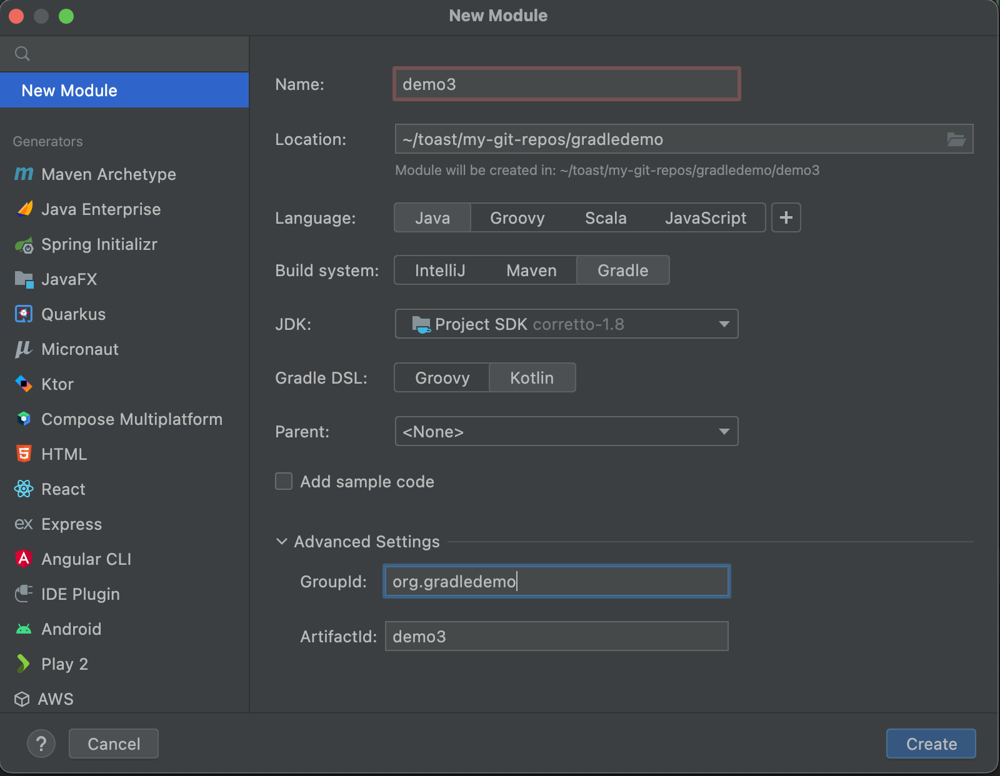

# Steps

1. cd into project
```shell
cd demo3
```

2. Create module using wizard


3. Build executable `jar`
```shell
./gradlew build
```

4. Run executable
```shell
java -cp build/libs/demo3-1.0-SNAPSHOT.jar org.gradledemo.demo3.Demo
```

5. Add dependency `org.apache.commons.commons-math3:3.6.1`
6. Use dependency with `Prime.isPrime` API
7. Build executable `jar`
```shell
./gradlew build
```
8. Run executable
```shell
java -cp build/libs/demo3-1.0-SNAPSHOT.jar org.gradledemo.demo3.Demo
```
9. Fix failure by creating a fat jar
Uncomment fat jar code in `build.gradle.kts`
